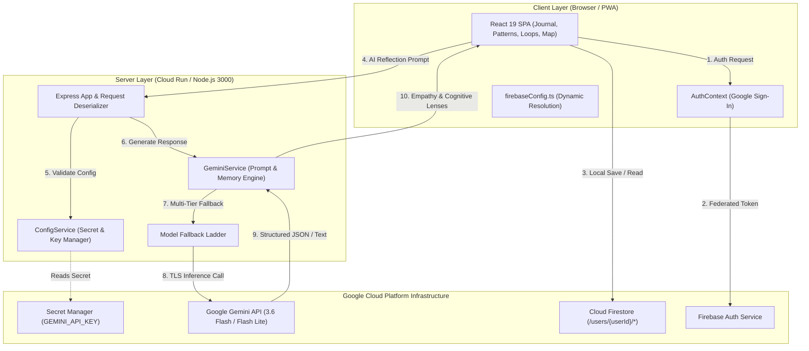
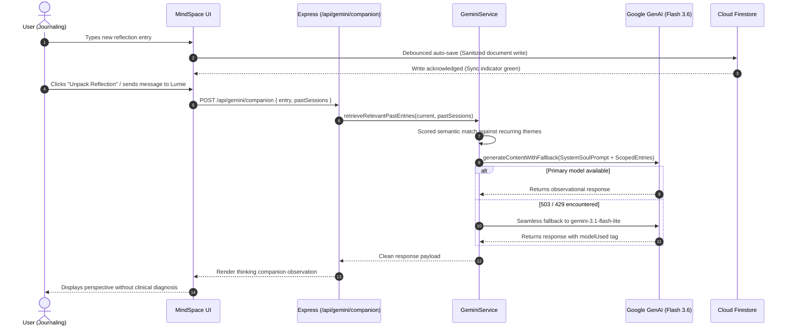

# MindSpace — Private AI-Powered Personal Reflection Workspace

> **Think. Write. Reflect. Move Forward.**  
> A full-stack, privacy-first personal reflection and productivity workspace built with React 19, Tailwind CSS, Google Cloud Run, Cloud Firestore, and the Gemini 3.6 Flash API with resilient multi-tier fallback architecture.

---

## 1. Executive Summary & Core Architecture

MindSpace bridges distraction-free reflective writing with multi-turn cognitive exploration:
* **Client Frontend**: React 19 + TypeScript single-page application styled with Tailwind CSS, supporting responsive mobile/desktop layouts and Progressive Web App (PWA) offline capabilities.
* **Server Backend**: Node.js + Express unified server running Vite middleware in development and serving high-performance bundled static assets in production (`dist/server.cjs`).
* **AI Cognitive Engine**: Gemini 3.6 Flash integration powered by `@google/genai` with automated model fallback (`gemini-3.8-flash` &rarr; `gemini-3.1-flash-lite` &rarr; `gemini-3.6-flash` &rarr; `gemini-flash-latest` &rarr; `gemini-3.7-flash`), structured schema outputs, and prepayment depletion protection.
* **Data Isolation & Storage**: Google Cloud Firestore utilizing owner-bound security rules (`request.auth.uid == userId`) to guarantee strict cross-tenant privacy.
* **Authentication**: Firebase Authentication with Federated Google Sign-In (no passwords handled, stored, or transmitted in application code).

---

## 2. System Flow Diagrams

### High-Level System Architecture



### Text/ASCII Architectural Overview

```
+---------------------------------------------------------------------------------+
|                                 CLIENT BROWSER                                  |
|  +--------------------------+  +---------------------+  +--------------------+  |
|  | React 19 UI & Pages      |  | AuthContext (G-Auth)|  | firebaseConfig.ts  |  |
|  +-------------+------------+  +----------+----------+  +---------+----------+  |
+----------------|--------------------------|-----------------------|-------------+
                 | HTTPS API                | OAuth2 Token          | Direct SDK
                 v                          v                       v
+-----------------------------------+  +-----------------+  +---------------------+
| EXPRESS BACKEND (Port 3000)       |  | Firebase Auth   |  | Cloud Firestore     |
| - Express JSON Payload Parser     |  +-----------------+  | - /users/{userId}/* |
| - server/configService.ts         |                       | - Hardened Rules    |
| - server/geminiService.ts         |                       +---------------------+
| - Resilient Fallback Ladder       |
+----------------+------------------+
                 |
                 | TLS 1.3 / @google/genai
                 v
+---------------------------------------------------------+
| GEMINI API PLATFORM                                     |
| 1. gemini-3.8-flash  ==> 2. gemini-3.1-flash-lite ==>   |
| 3. gemini-3.6-flash  ==> 4. gemini-flash-latest         |
+---------------------------------------------------------+
```

---

### Reflection & Thinking Companion Data Flow



---

## 3. Complete Repository Structure & Project Guide

```
ai-studio-mindspace/
├── .env.example                 # Template for required environment variables
├── .gitignore                   # Node, bundle, and environment exclusions
├── README.md                    # Project documentation, deployment, and testing guide
├── firebase-applet-config.json  # Firebase project client configuration descriptor
├── firestore.rules              # Cloud Firestore security rules with user-data isolation
├── index.html                   # HTML entry point with synchronized metadata & OpenGraph tags
├── metadata.json                # AI Studio application capabilities and permissions
├── package.json                 # Project dependencies, build scripts, and engine specifications
├── tsconfig.json                # TypeScript compiler configuration
├── vite.config.ts               # Vite configuration with PWA plugin and Tailwind integration
├── public/                      # Static assets, PWA manifests, icons, and service workers
├── server/                      # Dedicated server-side modules (Backend Separation of Concerns)
│   ├── configService.ts         # Centralized runtime configuration & non-sensitive telemetry
│   └── geminiService.ts         # Google GenAI client, fallback ladder, and Soul prompts
├── server.ts                    # Unified Express entry point & API request router
└── src/                         # Client-side React 19 application
    ├── App.tsx                  # Root application router and layout orchestrator
    ├── main.tsx                 # React DOM mount point
    ├── types.ts                 # Shared TypeScript domain models and interfaces
    ├── index.css                # Global Tailwind CSS stylesheet
    ├── assets/                  # Client-side image and SVG assets
    ├── config/
    │   └── firebaseConfig.ts    # Secure Firebase client configuration resolver
    ├── context/
    │   └── AuthContext.tsx      # Google authentication provider & session observer
    ├── hooks/
    │   └── usePWAInstall.ts     # PWA install prompt handler
    ├── services/
    │   ├── firebase.ts          # Firebase App, Auth, and Firestore SDK initialization
    │   ├── firestoreService.ts  # Database operations with zero-crash payload sanitization
    │   └── geminiClient.ts      # Client-side HTTP client invoking backend /api/gemini/* routes
    ├── components/              # Shared UI components (Navigation, Mascot, Modals, Toast)
    └── pages/                   # Application views
        ├── DashboardPage.tsx    # Recent thoughts, prompt of the day, mood snapshot
        ├── JournalPage.tsx      # Focus editor, Lumie companion, thinking lenses
        ├── PatternsPage.tsx     # Recurring themes and cognitive habits analyzer
        ├── UnresolvedThoughtsPage.tsx # Open cognitive loops tracker
        ├── ThinkingMapPage.tsx  # Semantic graph visualization of connected thoughts
        ├── AskJournalPage.tsx   # Cross-journal natural language exploration
        ├── WeeklyReviewPage.tsx # Automated weekly synthesis and progress rewind
        ├── DecisionsPage.tsx    # Decision journal with framework helpers
        ├── ActionPlansPage.tsx  # Actionable next steps extracted from reflections
        ├── GoalsPage.tsx        # Long-term aspirations and alignment tracking
        ├── HistoryPage.tsx      # Chronological timeline and entry search
        ├── SavedPage.tsx        # Bookmarked thoughts and key reflections
        ├── RewindPage.tsx       # Year-in-review and periodic retrospectives
        └── SettingsPage.tsx     # Privacy controls, export options, and theme preferences
```

---

## 4. Local Development & Testing Guide

### Prerequisites
* **Node.js**: Version 20.x or higher (`node -v`)
* **npm**: Version 10.x or higher (`npm -v`)
* **Git**: Installed and configured

### Step 1: Clone Repository and Install Dependencies
```bash
# Clone the repository
git clone <YOUR_REPOSITORY_URL>
cd ai-studio-mindspace

# Install dependencies cleanly
npm install
```

### Step 2: Configure Environment Variables
Create a local `.env` file from `.env.example`:
```bash
cp .env.example .env
```

Edit `.env` to include your Gemini API key (obtained free from [Google AI Studio](https://aistudio.google.com/)):
```env
GEMINI_API_KEY="YOUR_GEMINI_API_KEY_HERE"
```
*(Optional: Firebase keys can be added to override `firebase-applet-config.json` via `VITE_FIREBASE_API_KEY`)*

### Step 3: Run the Development Server
Launch the unified server (starts Express on port 3000 with Vite middleware):
```bash
npm run dev
```

Visit `http://localhost:3000` in your web browser.

---

### Step 4: Automated CLI / Diagnostic Testing
Open a secondary terminal window while the server is running to verify backend service modules:

#### Test 1: Service Health & Diagnostic Check
```bash
curl -s http://localhost:3000/api/health
```
*Expected Output*:
```json
{"status":"ok","geminiConfigured":true}
```

#### Test 2: Credential Telemetry (Masked Verification)
```bash
curl -s http://localhost:3000/api/config/status
```
*Expected Output*:
```json
{
  "geminiConfigured": true,
  "geminiKeyLength": 53,
  "geminiMaskedKey": "AQ.A...CnRQ",
  "firebaseProject": "ai-studio-mindspace-ca433b64-5c25-46ce-9f82-e5962089abd9",
  "nodeEnv": "development"
}
```

#### Test 3: Structured Smart Prompt Generation
```bash
curl -s -X POST http://localhost:3000/api/gemini/smart-prompt \
  -H "Content-Type: application/json" \
  -d '{"recentThemes":["clarity","decision"]}'
```
*Expected Output*: A JSON object containing `"prompt"`, `"category"`, and `"context"`.

#### Test 4: Companion Inference & Soul System Response
```bash
curl -s -X POST http://localhost:3000/api/gemini/companion \
  -H "Content-Type: application/json" \
  -d '{"message":"I feel torn between committing to a new project or resting.","entryContent":"Busy week.","pastSessions":[]}'
```
*Expected Output*: A supportive, non-clinical observational reflection from Lumie.

---

### Step 5: Manual Functional Test Walkthrough

| Test Case | Module | User Action / Flow | Expected System Behavior |
| :--- | :--- | :--- | :--- |
| **TC01: Initial Load** | Application Shell | Open `http://localhost:3000` in browser | Application loads with zero console errors. Dashboard displays greeting, Daily Prompt, and quick entry widget. |
| **TC02: Authentication** | Firebase Auth | Click "Sign in with Google" or continue in Guest Mode | In Google mode, pop-up authenticates user; user avatar and cloud sync indicator appear. In Guest mode, local storage persistence is active. |
| **TC03: Journal Writing** | Journal Editor | Navigate to **Journal**, enter title & reflection text | Word count updates. Auto-save triggers within 2 seconds; cloud sync badge confirms save with zero undefined errors. |
| **TC04: Companion Chat** | Thinking Companion | Type in Lumie companion drawer: "Help me unpack this." | Companion retrieves context and generates an observational response without clinical diagnosis or judgment. |
| **TC05: Cognitive Lenses** | Reflection Tools | Click "Cognitive Reframing" or "Action Extraction" | A structured card appears breaking down unstated assumptions and actionable next steps. |
| **TC06: Pattern Scanner** | Patterns Page | Navigate to **Patterns** and click "Analyze Trends" | System identifies recurring themes across past entries (e.g., Work-Life Balance, Decision Hesitation). |
| **TC07: Open Loops** | Unresolved Thoughts | Navigate to **Unresolved Loops** | Incomplete thoughts or open dilemmas are categorized with an option to mark resolved or convert into an action plan. |
| **TC08: Thinking Map** | Semantic Visualizer | Navigate to **Thinking Map** | Interactive D3/SVG graph renders nodes connecting related reflection themes and tags. |

---

## 5. Google Cloud Run & Secret Manager Deployment

### Step 1: Environment & Tooling Setup
Ensure the Google Cloud SDK (`gcloud`) is installed and authenticated:
```bash
export PROJECT_ID="YOUR_GOOGLE_CLOUD_PROJECT_ID"
export REGION="asia-southeast1" # Set to your target region

gcloud config set project $PROJECT_ID
```

Enable required cloud APIs:
```bash
gcloud services enable \
  run.googleapis.com \
  secretmanager.googleapis.com \
  firestore.googleapis.com \
  identitytoolkit.googleapis.com
```

### Step 2: Secret Management Setup
Store your Gemini API key in Google Cloud Secret Manager to prevent hardcoded credentials:

```bash
# 1. Create the secret in Secret Manager
gcloud secrets create GEMINI_API_KEY --replication-policy="automatic"

# 2. Populate the secret with your API key
echo -n "YOUR_API_KEY" | gcloud secrets versions add GEMINI_API_KEY --data-file=-

# 3. Retrieve your project number
PROJECT_NUMBER=$(gcloud projects describe $PROJECT_ID --format="value(projectNumber)")

# 4. Grant the default Cloud Run runtime service account access to read the secret
gcloud secrets add-iam-policy-binding GEMINI_API_KEY \
  --member="serviceAccount:${PROJECT_NUMBER}-compute@developer.gserviceaccount.com" \
  --role="roles/secretmanager.secretAccessor"
```

### Step 3: Cloud Firestore Security Rules Configuration
Deploy the hardened, user-isolated Firestore security rules:

```javascript
rules_version = '2';
service cloud.firestore {
  match /databases/{database}/documents {
    // User data isolation: path owner must match authenticated user token
    match /users/{userId} {
      allow read, write: if request.auth != null && request.auth.uid == userId;

      match /{allSubcollections=**} {
        allow read, write: if request.auth != null && request.auth.uid == userId;
      }
    }

    // Required user interactions validation block
    match /users/{userId}/interactions/{interactionId} {
      allow read, write: if request.auth != null && request.auth.uid == userId;
    }

    // Default deny
    match /{document=**} {
      allow read, write: if false;
    }
  }
}
```

Deploy the rules via Firebase CLI:
```bash
firebase deploy --only firestore:rules
```

### Step 4: Deploy to Cloud Run
Deploy the application container with automated secret binding:

```bash
gcloud run deploy mindspace \
  --source . \
  --region=$REGION \
  --platform=managed \
  --allow-unauthenticated \
  --set-secrets=GEMINI_API_KEY=GEMINI_API_KEY:latest \
  --port=3000
```

### Step 5: Required Campaign Labeling
To register the deployed service for automated challenge verification:

```bash
gcloud run services update mindspace \
  --update-labels=dev-tutorial=cloud-run-ai-challenge \
  --region=$REGION
```

---

## 6. Threat Modeling & Security Review

| Threat Zone | Identified Risk | Countermeasure Implemented |
| :--- | :--- | :--- |
| **Input Surfaces** | Malicious injection & oversized payloads | Strict 10MB JSON body limit, payload sanitization, recursive `undefined`-stripping prior to Firestore writes. |
| **Planning & Reasoning** | Prompt injection attempting to alter assistant persona | System Soul prompt strictly enforces observational framing; untrusted user inputs are delimited as data rather than instructions. |
| **Tool & AI Execution** | Prepayment depletion or API service interruption | Resilient model fallback ladder (`gemini-3.8-flash` &rarr; `gemini-3.1-flash-lite` &rarr; `gemini-3.6-flash` &rarr; `gemini-flash-latest`) with backoff retry handling. |
| **Memory & State** | Cross-tenant data leakage | Cloud Firestore security rules mandate `request.auth.uid == userId` on all document paths. |
| **Inter-System Communication** | Key leakage in client code or source version control | Zero Gemini keys in frontend client bundles; keys resolved exclusively server-side via `server/configService.ts` from environment or Secret Manager. |

---

## 7. License & Support

Distributed under the MIT License. For questions or support, visit [Google AI Studio](https://aistudio.google.com/).
